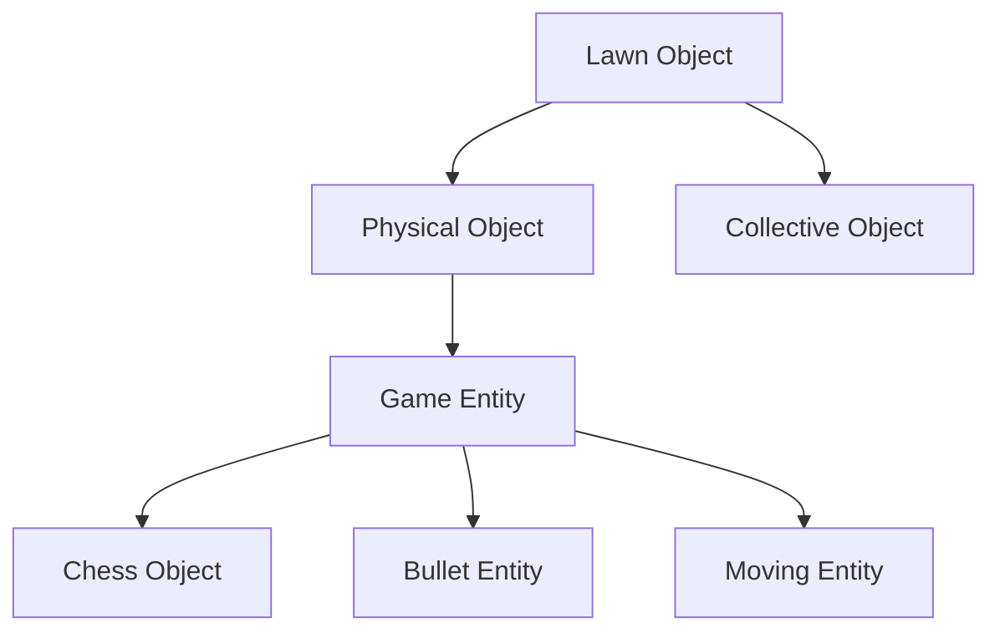

# flora

flora 是一个花园塔防游戏框架，基于 [Godot](https://godotengine.org) 游戏引擎实现。

**目录**
- [flora](#flora)
  - [Level 流程](#level-流程)

## Level 流程

框架内的单个可游玩关卡称为一个 `Level`。关卡的静态信息（如难度、特殊玩法、初始阳光、地图布局等）由 `LevelInfo` 控制。

关卡内的对象设计如下：

在关卡内，除暂停界面外的所有可视对象在代码中均为 `LawnObject`，如卡槽、植物卡片、铲子和地面等。其具体子类的描述如下：

| 子类              | 描述                                                                                             |
| ----------------- | ------------------------------------------------------------------------------------------------ |
| Physical Object   | 具有**碰撞箱**的对象，在 Godot 引擎中表现为具备 `Area2D` 的对象。                                |
| Collective Object | 不具备碰撞箱且**可被收集**的对象，如阳光、钱币等。                                               |
| Game Entity       | 游戏实体，是具有**碰撞箱和状态机**的对象。                                                       |
| Chess Object      | “**棋子**”，与棋盘绑定的对象，如种植于草坪上的植物。如果棋盘是可移动的，则棋子会跟随其一起移动。 |
| Bullet Entity     | **子弹**类型实体，沿固定的行动模式改变位置。                                                     |
| Moving Entity     | 移动类实体，具备**寻路**功能。在非直线棋盘中，会沿着正确道路前进。                               |
